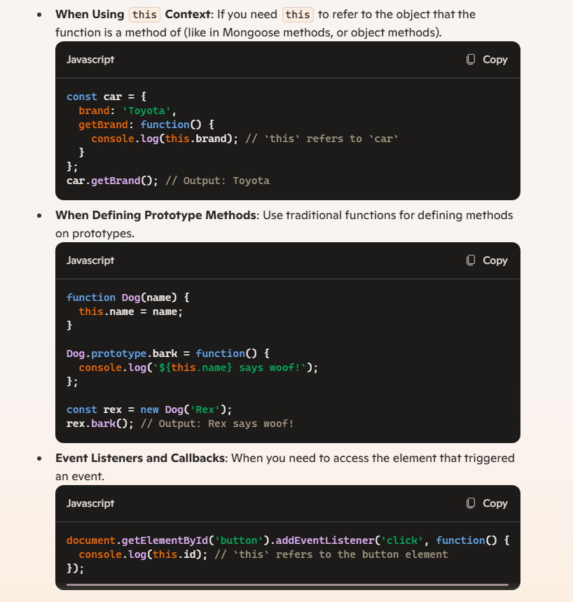
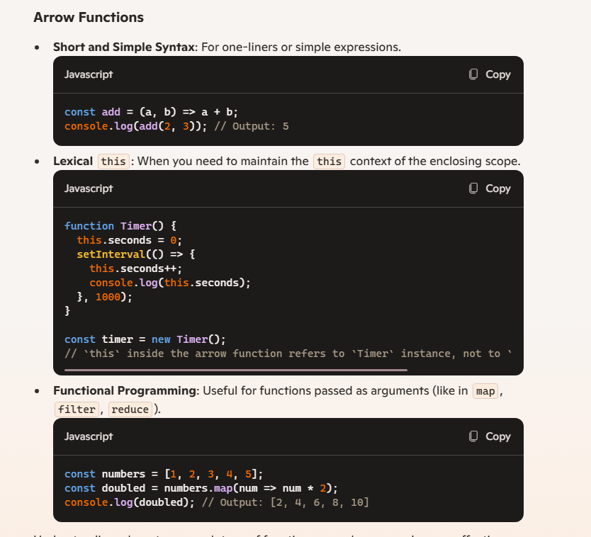

# Learn Mongoose 

    const mongoose = require('mongoose');
    mongoose.connect('mongodb://127.0.0.1:27017/movieApp')//this creates a db movieApp
        .then(() => {
        console.log("Connection Sucesful")
        })
        .catch(err => {
        console.log("failed")
        })
    const movieSchema = new mongoose.Schema({
        title: String,
        year: Number,
        score: Number,
        rating: String
    })
## N the name of model is "Movie" now
    const Movie = mongoose.model('Movie', movieSchema);//remember the 1st letter is caps
### and mongoose will make a collection of movies(plular) collection
## Now i can make new instances n save to mongo db

    const amadues = new Movie({ title: 'Amadeuos', year: 1983, score: 9.4, rating: 'R' })
    amadues.save();//after creating the instance we have to save it

## Validations
>we can put validations ineach db properties

>but when wetry n update them it won't work
>So went have to tell again to use all the validations

    Product.findOneAndUpdate({ name: 'Tyre pump' }, { price: 99 },{ new: true, runValidators: true })
## Updating
for updating like findOneAndUpdate we don't new to save() it.It automatically returns a promise
we can use .then and .catch on that

    Product.findOneAndUpdate({name:'Tyre pump'},{price:200,new:true})

    //if we put new:true then only it will display new updated value
    then use this below one
    Product.findOneAndUpdate({name:'Tyre pump'},{price:200,new:true,runValidators:true})

## Mongoose virtuals

    personSchema.virtual('fullName').get(function (){
    return `${this.first} ${this.last}`
    })
    personSchema.virtual('fullName').set(function (v){
            // `v` is the value being set, so use the value to set
            // `firstName` and `lastName`.
            const first = v.substring(0, v.indexOf(' '));
            const last = v.substring(v.indexOf(' ') + 1);
            this.set({ first, last });
    })

## MIDDLEWARE

//write code before or after something is written and executed like that using the MIDDLEWARE
post and rpe hooks // hooks are synchronous

    personSchema.pre('save', async () => {
    console.log("about to save")
    })
    personSchema.post('save', async () => {
    console.log('just saved')
    })
    const Person = mongoose.model("Person", personSchema);
//if u are deleting a user we have to delete all the user n his comments from the app
//while using mongoose dont use arrow functions at all

## TRADITIONAL FUNCTIONS VS ARROW FUNCTIONS

//traditional==> in traditional function the this is refered to parent object
//Arrow ==> while in case of arrow function it is linked to the document object

### when to use traditional

### when to use arrow functions

