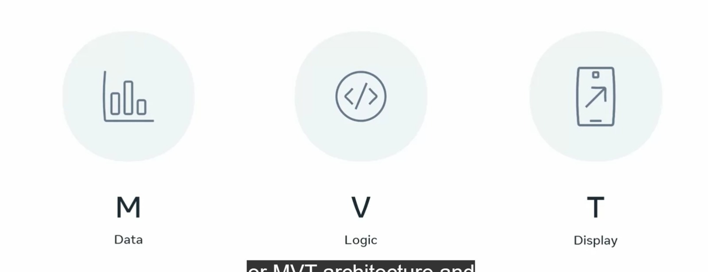

# Django Project Setup Guide

## Understanding Virtual Environments and Development Servers in Django

When working with Django, it's essential to use a **virtual environment** for each project. This helps keep dependencies separate and prevents conflicts.

**Install python** 
```
from the official python website.
```
[Python download Click me !]('https://www.python.org/downloads/')

**Install pip**
run the folling command in python terminal
```
python -m pip install --upgrade pip
```

>
>**django-admin:** A utility found in the scripts folder, executed in the terminal. It is installed automatically when you install Django via pip.
>
>**manage.py:** A script that serves as a local version of django-admin. It is created when you set up a new project.
>
>Note: Low port numbers are reserved for root users. Django automatically restarts the server when you make changes, but adding new files doesn’t trigger a restart.

## Setting Up Your Development Environment

### Create a Virtual Environment
Activate the Environment (usually by running a script in the venv folder)
**Start a New Project:**
```
django-admin startproject myproject
```
**Navigate into Your Project:**
```
cd myproject
```
**Create a New App:**
```
django-admin startapp myapp
```

### Understanding Django Apps
A Django app is a reusable component of a project. You can link one app to another project's website.

**To create a new app within your project, use:**
```
python manage.py startapp demoapp
```
The urls.py file can be configured at both the project and app levels. If the urls.py file is missing in your app folder, you need to create one. Additionally, you should update the urls.py in the main project as well as the settings.py file in the project folder to include your new app in the installed apps list.

**Run the Development Server:**
```
django-admin runserver
```
This command starts the server on the default Django port.
Django Management
After creating a project, you can use either **django-admin** or **manage.py** for administrative tasks:

## Benefits of Using Django
**Fast Development:** Rapidly build applications.
**Clean Code Structure:** Organized and maintainable code.
**Code Reusability:** Easily reuse components across projects.

---

## Django's Role in Architecture
### Django is primarily used to build backend applications and fits into a 3-tier architecture:

**Presentation Tier:** User interface (e.g., React for desktop UI).
**Application Tier:** Web and application server.
**Data Tier:** Database server.
<div style="display: flex; justify-content: center; ">
    
</div>

### Features of django
- web frame works provides a solid foundation so that our home is stronger
- Django is high level free open source python web framework
- security and scalability
- many features auth and site map and rss
- Internal sercure middle to handle attacks
  


---
## MVC approach in django
    In the MVC approach, the controller intercepts the user requests. 
    It coordinates with the view and model layers to send the appropriate response back to the client.

#### Model
The **model** is responsible for data definitions, interaction with the backend database.(Model)
#### View
The **view** is the presentation layer of the application. It takes care of the placement and formatting of the result and sends it to the controller, which in turn, redirects it to the client as the application's response.(Tempaltes )
#### Controller
The **controller** is the core of the MVC pattern. It receives the request from the client,
coordinates with the model and view layers to process the request and send the response back to the client.(Views and the urls)


---
### Django's Model, View and Template (MVT)


django **urls.py** is similar to a controller in MVC
it defines **url patterns** and map with a view funciton
**views**  functions read path,query and body params to include in model and perform crud operations
**model** is a python class put in models.py
Django **migrates the attributes** of the model class to construct a database table of a matching structure.
Object Relational Mapper-->creates a sqlite db-->helps oops way perform CRUD
#### Template
contains mix of **static html**  and django template code blocks
You place Template web pages in the **templates folder** with the .html extension.
django **template processor** uses context data and make **dynamic webpages** from **views**
**data logic** and **display** are separate in django how developers use django in backend



view  performs as controller in django views
http request response for static website in python we have to write a function called as view
django.http module impet httpresponse each function take request n send back response
the view function should be mapped to an **url mapping** is called as **routing**

---
### create urls.py in app

<p style="width: 60%; display: inline; border: 2px solid grey; color: skyblue; position: relative; top: -20%;">In a URL pattern, the first argument is the path pattern, and the second argument is the relative path. 

To populate the route arguments later, you can use the following approach:

1. **URL Configuration**: The `urls.py` file exists at both the project level and the app level for organization and modularity. 

2. **Project Level `urls.py`**: This file typically includes the main URL patterns for the entire project.

3. **App Level `urls.py`**: This file contains URL patterns specific to that app. 

4. **Using `include()` Function**: The `include()` function allows you to reference the app's `urls.py` in the project’s `urls.py`, making it easier to manage routes.In django `include()` path of django.urls **should be in side string**

5. **Clustering URLs at the App Level**: By defining URLs at the app level, you can keep related URL patterns organized, preventing them from becoming cluttered at the project level.</p>

**url** ==> send the traffic to certain page or redirects
**view** ==> has all the logic
     ` Get ==> READ or DELETE ==>`
      `POST ---> INSERT or UPDATE`
**model** ==> is like a database which it can perform crud,Adding new instances
**CRUD** is a set of four operations that can be performed on a database or data

## Function based view
<div style="display: flex; justify-content: center; ">
    
</div>

## Class based view
<div style="display: flex; justify-content: center; ">
    
</div>
the class based view is more powerful than function based view
it has generic inbuilt methods like get,post,put,delete,patch etc in it 

## Generic View
<div style="display: flex; justify-content: center; ">

</div>

---
## Http Requests

In browser we can see a lock in website it means its a htt[s] -> encrption secure shell = before content is sent it is turned to a secret code
http`(hyper text transfer protocol)` is not secure but a protocol for serving `web pages`
1) web pages
2) images
3) other files
http = request and response

<div style="display: flex; justify-content: center; ">

</div>
 it consists of

<div style="display: flex; justify-content: center; ">

</div>

 - Method/path/version 
   - `GET /path  HTTP/1.1 or 2.0`
 - headers
   - Host ``host:developer.mozilla.org``
   - Accept-language ``en-US,en;q=0.5``
-  Headers contains
   - server name
   - Server port
   - Request method -> contains body of the client too
   - content type
  
Most used methods are:
1) GET -> Retrive
2) POST -> Send
3) PUT -> Update
4) DELETE -> Remove

## HTTP Response
<div style="display: flex; justify-content: center; ">


</div>
Following the request, the server will send a response back to the client. The response will contain the following information like html pages, images etc

- Response
  - Headers
  - date
  - **status codes**
  - server
  - last-modified
  - content-length
  - content type

  

### status code
<div style="display: flex; justify-content: center; ">


</div>

- **200 ok status**
  - GET = found/included
  - POST = Sucessfull
  - PUT = Sucessfull
  - DELETE = Deleted
- **300 Redirection status**
  - 301 = permenantly moved
  - 302 - temporaily moved
- **400 Cliet error status**
  - 400 = submitted bad data
  - 401 = Login before request
  - 403 = Request good but client has doesn't have certain previlages
  - 404 = Resource not found
- **500 Server error status**
  - 500 = Internal server error

